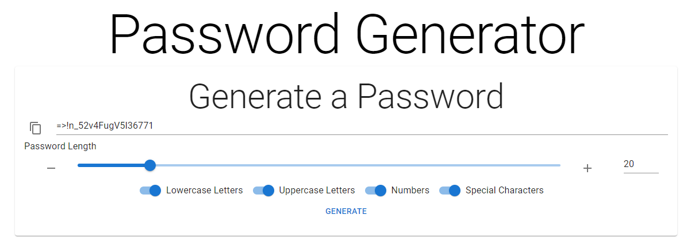

# Password Generator

## Description

A simple JavaScript application used to generate a random password based on selected criteria.

This was a project done for a coding bootcamp that covered the following skills:

- JavaScript conditional statements
- JavaScript `window` object (`alert`)

## Features

- Click generate password button to receive prompts for password specifications
- Provide input via JavaScript alerts to gather specifications
- Generate random password and display to the screen

## Screenshot

## Live Site

[Link](https://jdpasternak.github.io/password-generator/)
